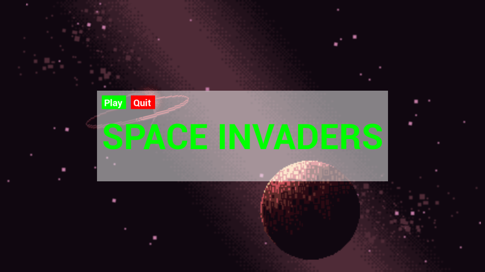
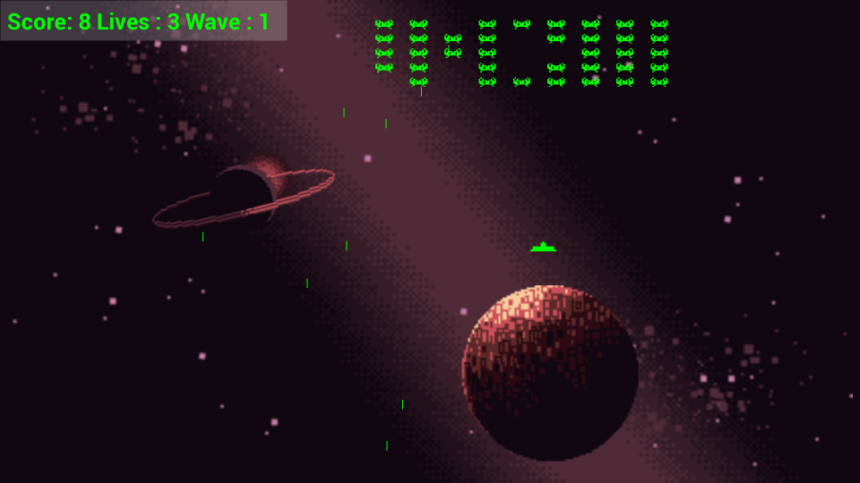
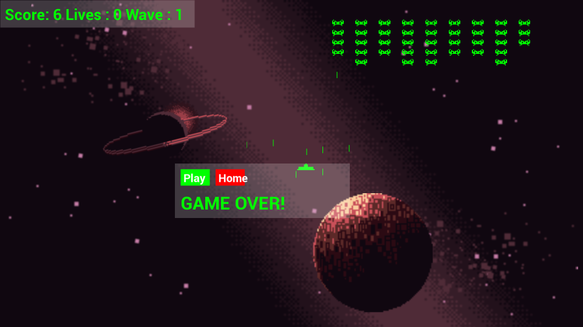

# SpaceInvadersPP
 A basic implementation of 'Space Invaders' using my C++ Engine built with SFML in 2020.

 To run the compiled executable, you must place it in a directory containing the following from the development folder:
 * fonts
 * graphics
 * sound
 * world
 * .dll files

 
 
 
